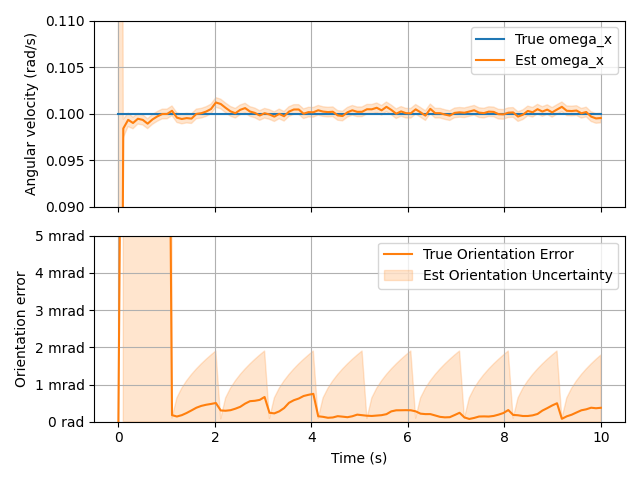

# autopilot

This started as a sandbox project where I wanted to just play around with control systems and sensors. I am now using it as an exercise to learn and implement Kalman filtering for a spacecraft navigation system.

---

The above graph shows an early test using an Extended Kalman Filter collecting data from (1) a continuously running gyroscope and (2) a star tracker that produces readings once per second. (I don't think real star trackers can easily take readings while the spacecraft has significant angular velocity but it's for the sake of the filter testing here)

---

Here is a (simplified) Earth atmospheric entry and landing simulation. The next step is to add an attitude control system and try some S-turns!

## Features & Feature Ideas

* Simulation tools
  * History: a tool to monitor a set of values throughout the simulation and record them in numpy arrays
  * Graphing & visualization
  * Environments: for example, celestial bodies, relative velocity/attitude transformations
  * Simulation states and flags: for example, detecting that the ship has collided with something
* State: generalized vector describing a rigid body's position, orientation, and their time derivatives
* Ship: rigid body model with sensor system, control system, and actors
* Sensors:
  * Sensor system: some method to turn sensor data into state estimates, Kalman filter, etc
    * Ideal/dummy system: simply returns the true state of the ship
    * EKF system: uses extended Kalman filter
    * Gaussian sensor noise
    * Sensor bias?
      * Unbiasing/calibration methods?
      * Extended state vector?
  * Sensor types:
    * Gyroscope
    * Star tracker
    * Sun sensor
    * Horizon sensor
    * Accelerometer
    * Distance signal (distance reading from a known satellite, like a rangefinder or idealized single GPS signal)
    * Position sensor (essentially, the output of a GPS receiver system)
* Actor: anything that applies linear or angular acceleration to the ship
  * Gravity
  * Aerodynamic drag
  * Thrusters
    * Floating 6: 6 thrusters (+/- xyz) that remain aligned to world coordinates regardless of ship orientation
    * Fixed 6: 6 thrusters (+/- xyz) fixed to the ship's body frame. Can only be on or off
  * Reaction wheels
* Control system: some method to decide what the controllable actors (thrusters etc) should do
  * PID controller
  * Binary (on/off) controller
  * Navigation strategies for given tasks (for example, Entry/Descent/Landing)

## Setup

I use a venv for this. 

    cd autopilot
    python -m venv .venv
    
    # Unix/MacOS:
    source .venv/bin/activate
    
    # alternatively, on Windows:
    .venv\Scripts\activate

Then,

    python3 -m pip install --editable .